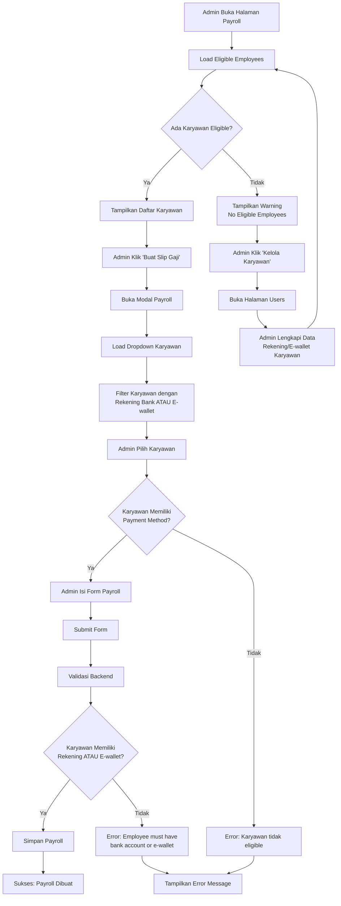
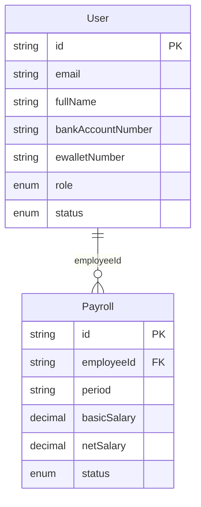
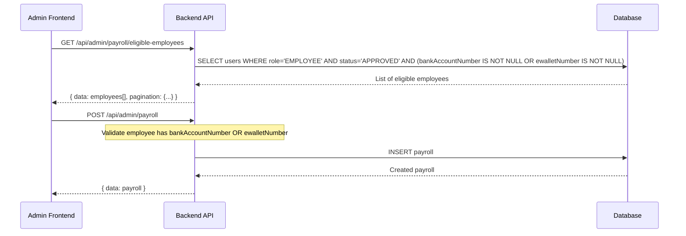
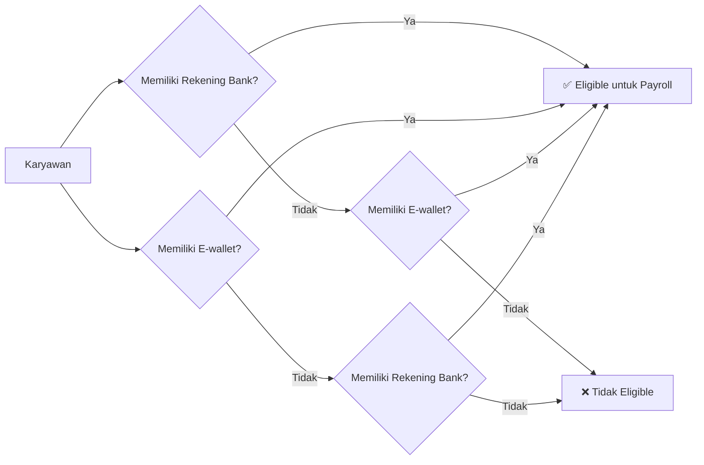
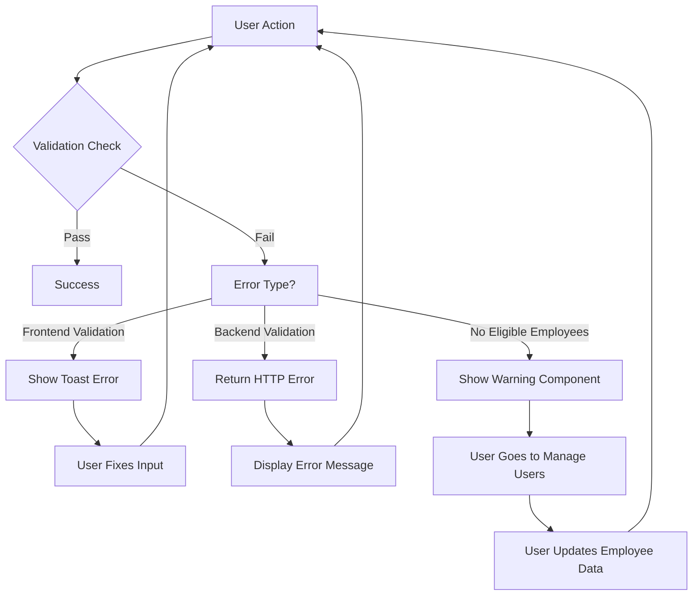

# Flow Validasi Slip Gaji - Rekening/E-wallet

## Diagram Flow Validasi

```mermaid
flowchart TD
    A[Admin Buka Halaman Payroll] --> B[Load Eligible Employees]
    B --> C{Ada Karyawan Eligible?}
    
    C -->|Ya| D[Tampilkan Daftar Karyawan]
    C -->|Tidak| E[Tampilkan Warning<br/>No Eligible Employees]
    
    D --> F[Admin Klik 'Buat Slip Gaji']
    F --> G[Buka Modal Payroll]
    G --> H[Load Dropdown Karyawan]
    H --> I[Filter Karyawan dengan<br/>Rekening Bank ATAU E-wallet]
    
    I --> J[Admin Pilih Karyawan]
    J --> K{Karyawan Memiliki<br/>Payment Method?}
    
    K -->|Ya| L[Admin Isi Form Payroll]
    K -->|Tidak| M[Error: Karyawan tidak eligible]
    
    L --> N[Submit Form]
    N --> O[Validasi Backend]
    O --> P{Karyawan Memiliki<br/>Rekening ATAU E-wallet?}
    
    P -->|Ya| Q[Simpan Payroll]
    P -->|Tidak| R[Error: Employee must have<br/>bank account or e-wallet]
    
    Q --> S[Sukses: Payroll Dibuat]
    R --> T[Tampilkan Error Message]
    M --> T
    
    E --> U[Admin Klik 'Kelola Karyawan']
    U --> V[Buka Halaman Users]
    V --> W[Admin Lengkapi Data<br/>Rekening/E-wallet Karyawan]
    W --> B
```

## Database Schema

```mermaid
erDiagram
    User {
        string id PK
        string email
        string fullName
        string bankAccountNumber
        string ewalletNumber
        enum role
        enum status
    }
    
    Payroll {
        string id PK
        string employeeId FK
        string period
        decimal basicSalary
        decimal netSalary
        enum status
    }
    
    User ||--o{ Payroll : "employeeId"
```

## API Endpoints

```mermaid
sequenceDiagram
    participant Admin as Admin Frontend
    participant API as Backend API
    participant DB as Database
    
    Admin->>API: GET /api/admin/payroll/eligible-employees
    API->>DB: SELECT users WHERE role='EMPLOYEE' AND status='APPROVED' AND (bankAccountNumber IS NOT NULL OR ewalletNumber IS NOT NULL)
    DB-->>API: List of eligible employees
    API-->>Admin: { data: employees[], pagination: {...} }
    
    Admin->>API: POST /api/admin/payroll
    Note over API: Validate employee has bankAccountNumber OR ewalletNumber
    API->>DB: INSERT payroll
    DB-->>API: Created payroll
    API-->>Admin: { data: payroll }
```

## Validation Logic

```mermaid
flowchart LR
    A[Karyawan] --> B{Memiliki Rekening Bank?}
    A --> C{Memiliki E-wallet?}
    
    B -->|Ya| D[✅ Eligible untuk Payroll]
    B -->|Tidak| E{Memiliki E-wallet?}
    
    C -->|Ya| D
    C -->|Tidak| F{Memiliki Rekening Bank?}
    
    E -->|Ya| D
    E -->|Tidak| G[❌ Tidak Eligible]
    
    F -->|Ya| D
    F -->|Tidak| G
```

## Error Handling Flow

```mermaid
flowchart TD
    A[User Action] --> B{Validation Check}
    B -->|Pass| C[Success]
    B -->|Fail| D[Error Type?]
    
    D -->|Frontend Validation| E[Show Toast Error]
    D -->|Backend Validation| F[Return HTTP Error]
    D -->|No Eligible Employees| G[Show Warning Component]
    
    E --> H[User Fixes Input]
    F --> I[Display Error Message]
    G --> J[User Goes to Manage Users]
    
    H --> A
    I --> A
    J --> K[User Updates Employee Data]
    K --> A
```
